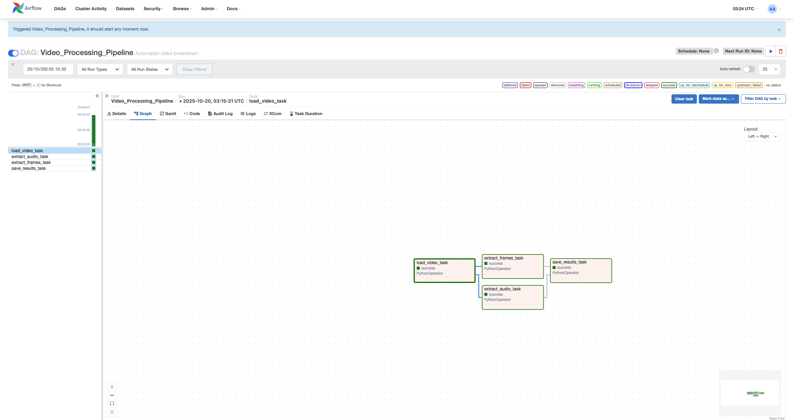

# Airflow Video Processing Pipeline

An automated video processing pipeline built with Apache Airflow that extracts and processes video components for machine learning applications.

## 🎯 Project Motivation

This project serves as the **foundation for a larger speech delivery analysis system**. The goal is to build an end-to-end MLOps pipeline that analyzes the quality of speech presentations by evaluating multiple factors:

- **Audio Analysis**: Prosody, pace, tone, filler words, pauses
- **Visual Analysis**: Posture, gestures, eye contact, facial expressions  
- **Content Analysis**: Speech structure, clarity, word choice

### Why Airflow?

Speech analysis requires orchestrating multiple complex tasks:
1. Video preprocessing and component extraction
2. Parallel processing through multiple ML models
3. Aggregation of results from different modalities
4. Reproducible, scalable pipeline for batch processing

**Airflow provides the orchestration layer** that makes this entire workflow manageable, scalable, and production-ready.

## 🏗️ Architecture

### Pipeline Flow Diagram

```
Video Input
    ↓
┌─────────────────────────────┐
│   load_video_task           │
│   - Validates video file    │
│   - Extracts metadata       │
└─────────────────────────────┘
    ↓
┌──────────────────────────────────────┐
│   Parallel Processing                │
├──────────────────┬───────────────────┤
│ extract_audio    │ extract_frames    │
│ - Audio stream   │ - Key frames      │
│ - WAV format     │ - Every 30th frame│
└──────────────────┴───────────────────┘
    ↓
┌─────────────────────────────┐
│   save_results_task         │
│   - Consolidate outputs     │
│   - Generate summary        │
└─────────────────────────────┘
```

### Airflow DAG Visualization



*Live view of the Video Processing Pipeline in Airflow UI showing task dependencies and parallel execution*

## 🚀 Features

- **Automated Workflow**: End-to-end video processing without manual intervention
- **Parallel Processing**: Audio and frame extraction run simultaneously
- **Task Dependencies**: Ensures proper execution order
- **Error Handling**: Robust error handling with retry logic
- **Monitoring**: Real-time pipeline monitoring via Airflow UI
- **Scalable**: Containerized with Docker for easy deployment

## 📁 Project Structure

```
airflow_lab_3/
├── dags/
│   ├── airflow_video.py          # DAG definition
│   ├── src/
│   │   ├── __init__.py
│   │   └── video_processing.py   # Processing functions
│   ├── videos/                   # Input videos
│   │   └── test_speech.mp4
│   └── outputs/                  # Processed outputs
│       ├── frames/               # Extracted frames
│       ├── audio/                # Audio files
│       └── processing_summary.txt
├── logs/                         # Airflow logs
├── plugins/                      # Custom plugins
├── config/                       # Airflow configs
├── docker-compose.yaml           # Docker orchestration
├── .env                          # Environment variables
├── .gitignore
└── README.md
```

## 🛠️ Tech Stack

- **Apache Airflow 2.9.2**: Workflow orchestration
- **Docker & Docker Compose**: Containerization
- **Python 3.12**: Core processing
- **imageio & imageio-ffmpeg**: Video/audio processing
- **opencv-python-headless**: Frame extraction
- **PostgreSQL**: Airflow metadata database
- **Redis**: Task queue management

## 📋 Prerequisites

- Docker Desktop installed and running
- At least 5GB RAM allocated to Docker
- Basic understanding of Python and command line

## 🔧 Setup Instructions

### 1. Clone the Repository

```bash
git clone https://github.com/yourusername/airflow-video-pipeline.git
cd airflow-video-pipeline
```

### 2. Configure Docker Memory

Open Docker Desktop → Settings → Resources → Set Memory to **5GB**

### 3. Initialize Airflow

```bash
# Fetch docker-compose.yaml
curl -LfO 'https://airflow.apache.org/docs/apache-airflow/2.9.2/docker-compose.yaml'

# Set environment variables
echo -e "AIRFLOW_UID=$(id -u)" > .env

# Initialize the database
docker compose up airflow-init
```

### 4. Start Airflow

```bash
docker compose up
```

Wait 2-3 minutes for all services to start.

### 5. Access Airflow UI

Navigate to `http://localhost:8080`

**Login credentials:**
- Username: `airflow`
- Password: `airflow`

### 6. Run the Pipeline

1. Find **"Video_Processing_Pipeline"** in the DAGs list
2. Click the ▶️ play button to trigger manually
3. Monitor execution in the Graph view
4. Check logs for detailed output

## ✅ Demo & Results

### Successful Pipeline Execution

The pipeline successfully processes videos with all tasks completing:


*All tasks completed successfully (shown in green)*

### Sample Outputs

- **Frames Extracted**: 10 key frames at 1-second intervals
- **Processing Time**: ~30 seconds for 10-second video
- **Output Files**: JPG frames + processing summary

Check the `dags/outputs/` directory for:
- `frames/` - Extracted video frames
- `processing_summary.txt` - Execution summary

## 📊 Pipeline Tasks

### Task 1: load_video_task
- Scans `dags/videos/` directory for MP4 files
- Validates video file existence
- Extracts basic metadata
- Returns serialized video information

### Task 2: extract_audio_task  
- Receives video information from Task 1
- Extracts audio stream (if available)
- Saves as WAV format in `outputs/audio/`
- Handles videos without audio gracefully

### Task 3: extract_frames_task
- Receives video information from Task 1  
- Samples every 30th frame (configurable)
- Extracts up to 10 frames for efficiency
- Saves as JPG in `outputs/frames/`

### Task 4: save_results_task
- Aggregates results from all previous tasks
- Generates processing summary
- Logs completion status
- Creates `processing_summary.txt`

## 🎓 Learning Outcomes

This lab demonstrates key MLOps concepts:

✅ **Workflow Orchestration**: Building DAGs with task dependencies  
✅ **Parallel Processing**: Running independent tasks concurrently  
✅ **Containerization**: Using Docker for consistent environments  
✅ **Error Handling**: Implementing retry logic and graceful failures  
✅ **Monitoring**: Tracking pipeline execution and debugging  
✅ **Scalability**: Designing for batch processing at scale  

## 🔮 Future Enhancements

### Phase 1: Complete Video Processing
- ✅ Frame extraction (completed)
- ⏳ Audio extraction refinement
- ⏳ OCR for text extraction from slides

### Phase 2: ML Model Integration
- Speech-to-text transcription (Whisper API)
- Posture detection (Computer Vision model)
- Gesture recognition (MediaPipe)
- Eye contact analysis (Face detection)
- Sentiment analysis (NLP model)

### Phase 3: Production Deployment
- Cloud deployment (AWS/GCP)
- Kubernetes orchestration
- Auto-scaling workers
- CI/CD pipeline integration
- Real-time processing capabilities

### Phase 4: Speech Quality Scoring
- Multi-modal result aggregation
- Weighted scoring algorithm
- Feedback generation
- User dashboard

## 🐛 Troubleshooting

### Error: Exit code 137
**Cause**: Insufficient Docker memory  
**Solution**: Increase Docker memory to 5GB+ in Settings

### Error: DAG Import Errors
**Cause**: Python cache or syntax errors  
**Solution**: 
```bash
find dags/ -type d -name "__pycache__" -exec rm -rf {} +
docker compose restart airflow-scheduler-1
```

### Error: No video found
**Cause**: Missing video file in `dags/videos/`  
**Solution**: Add an MP4 file to `dags/videos/` directory

## 📚 References

- [Apache Airflow Documentation](https://airflow.apache.org/docs/)
- [Airflow Best Practices](https://airflow.apache.org/docs/apache-airflow/stable/best-practices.html)
- [MLOps Principles](https://ml-ops.org/)
- [Docker Compose Guide](https://docs.docker.com/compose/)

## 📝 License

MIT License - feel free to use for learning and projects

## 👤 Author

**Your Name**
- LinkedIn: [your-profile]
- GitHub: [@yourusername]
- Email: your.email@example.com

---

**Course**: MLOps (Machine Learning Operations)  
**Institution**: Northeastern University  
**Lab**: Airflow Lab - Video Processing Pipeline  
**Date**: October 2025

---

## 🌟 Acknowledgments

- **Lab Credits**: Dhanush Kumar Shankar
- **Course Instructor**: Ramin Mohammadi
- **Institution**: Northeastern University, Khoury College of Computer Sciences

*This project demonstrates workflow orchestration principles that scale from lab exercises to production ML systems processing millions of videos.*